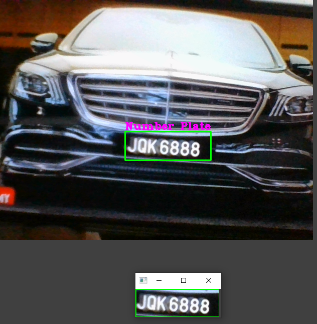
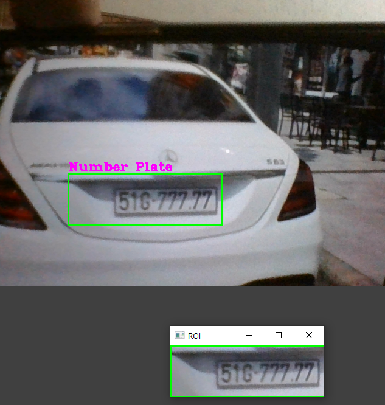

# Car Number Plate Detection and OCR

This repository contains a Python script for detecting car number plates in images captured from a camera feed and extracting the text from the detected number plates using Optical Character Recognition (OCR) techniques. The detected number plates are then saved as images in a specified folder along with the extracted text.


### Setting up Project Environment :

This project is a separate project using Conda of Anaconda. It provides a clear structure for organizing your code and dependencies using a virtual environment. The project includes the following folders and files:

- ocr-notebook/: This folder is used to store Jupyter notebooks for easy ocr details and coding practices.
- model : This folder contains the `haarcascade_russian_plate_number.xml`  model in it 
- plates/: This folder is used to store the plates images.
- .gitignore: This file specifies which files and folders should be ignored by Git.
- number_plate.py : This the main code you have to run to open camera to detect images and extract text and store it in plates folder.


## Haar Cascade Model

This project uses the `haarcascade_russian_plate_number.xml` Haar Cascade model for detecting car number plates. The model is provided in the `model` directory of this repository. If you need to use a different model or want to experiment with other Haar Cascade models, you can replace it with the desired XML file.

To use a different model:

1. Download the Haar Cascade XML file for the desired model.
2. Replace the existing `haarcascade_russian_plate_number.xml` file in the `model` directory with your downloaded XML file.
3. Modify the `car_number_plate_detection.py` script to load the new XML file:

   ```python
   # Load the pre-trained Haar Cascade model for car number plates
   plate_cascade = cv2.CascadeClassifier('model/your_new_model.xml')
   ```

## Code Explaination of number_plate.py

```python
min_area = 500
count = 0

while True:
    success, img = cap.read()

    plate_cascade = cv2.CascadeClassifier(harcascade)
    img_gray = cv2.cvtColor(img, cv2.COLOR_BGR2GRAY)

    plates = plate_cascade.detectMultiScale(img_gray, 1.1, 4)

    for (x,y,w,h) in plates:
        area = w * h

        if area > min_area:
            cv2.rectangle(img, (x,y), (x+w, y+h), (0,255,0), 2)
            cv2.putText(img, "Number Plate", (x,y-5), cv2.FONT_HERSHEY_COMPLEX_SMALL, 1, (255, 0, 255), 2)

            img_roi = img[y: y+h, x:x+w]
            cv2.imshow("ROI", img_roi)
```

This code detects car number plates in images and has a fixed min_area threshold. However, this threshold may not be suitable for all regions, as number plates vary in size and aspect ratio. To improve it:

- Implement dynamic thresholding based on frame dimensions or aspect ratio.
- Add region validation criteria.
- Normalize region sizes if necessary for OCR.

### Solution to above problem 

```python
import cv2
import pytesseract

# Initialize video capture
cap = cv2.VideoCapture(0)  # Change the argument to your camera source if needed

# Define acceptable aspect ratio range for number plates (adjust as needed)
min_aspect_ratio = 2.0
max_aspect_ratio = 5.0

# Define a minimum and maximum size for number plates (adjust as needed)
min_plate_size = 1000
max_plate_size = 10000

# Define the desired target size for OCR
target_width = 200  # Set the desired width
target_height = 50  # Set the desired height

while True:
    success, img = cap.read()

    # Calculate a dynamic min_area threshold based on frame dimensions
    frame_height, frame_width, _ = img.shape
    min_area_threshold = int(min(frame_height, frame_width) * 0.01)  # Adjust the multiplier as needed

    # Load the pre-trained Haar Cascade model for car number plates
    plate_cascade = cv2.CascadeClassifier('model/haarcascade_russian_plate_number.xml')
    
    img_gray = cv2.cvtColor(img, cv2.COLOR_BGR2GRAY)

    # Detect potential number plates using the Haar Cascade classifier
    plates = plate_cascade.detectMultiScale(img_gray, 1.1, 4)

    for (x, y, w, h) in plates:
        area = w * h
        aspect_ratio = w / h

        # Apply region validation criteria
        if min_aspect_ratio <= aspect_ratio <= max_aspect_ratio and min_plate_size <= area <= max_plate_size:
            cv2.rectangle(img, (x, y), (x+w, y+h), (0, 255, 0), 2)
            cv2.putText(img, "Number Plate", (x, y-5), cv2.FONT_HERSHEY_COMPLEX_SMALL, 1, (255, 0, 255), 2)

            img_roi = img[y: y+h, x:x+w]

            # Resize the region for OCR
            img_roi = cv2.resize(img_roi, (target_width, target_height))

            # Perform OCR on the region
            extracted_text = pytesseract.image_to_string(img_roi)

            # Save the extracted text to a text file (you can also process it as needed)
            with open('extracted_text.txt', 'w') as text_file:
                text_file.write(extracted_text)

    cv2.imshow("Car Number Plate Detection", img)

    if cv2.waitKey(1) & 0xFF == ord('q'):
        break

cap.release()
cv2.destroyAllWindows()

```

In this code:

- Dynamic thresholding is applied based on the frame dimensions.
- Region validation criteria check the aspect ratio and size of detected regions.
- Detected regions are resized to a consistent size for OCR.

Extracted text is saved to a text file (you can modify this part to suit your needs).Please adjust the validation criteria and OCR processing as necessary for your specific use case and region.

## Result

 <br>
 <br>

### AUTHOR
<hr>
<strong>Shehryar Gondal</strong>


You can get in touch with me on my LinkedIn Profile:<br>
 <a href = "https://linkedin.com/in/shehryar-gondal-data-analyst"></a>

You can also follow my GitHub Profile to stay updated about my latest projects:<br>
<a href = "https://github.com/ShehryarGondal1"></a>


If you liked the repo then kindly support it by giving it a star ⭐.


